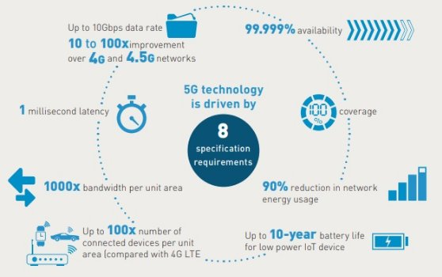


 
**

**

**

**

**Project Based Learning Report** 

on 

# **App based 5G NR Waveform Generation using WLAN Toolbox in MATLAB.**

Submitted in the partial fulfilment of the requirements 

For the Project based learning in **Cellular Technology & 4G** in 

Electronics & Communication Engineering 

By 

`   `**Name of the student		PRN**

Ali Shan Ahmad		2114110429

Nur Mohammed Ali		2114110430

MD Gafrujama Ansari	2114110431

Under the guidance of Course In-charge 

**Prof.Dr. Tanuja S. Dhope**

# **Department of Electronics & Communication** 
**Engineering** 

Bharati Vidyapeeth 

(Deemed to be University) 

College of Engineering, 

`     `Pune – 411043 

`                           `**Academic Year 23-24**

`     `**Bharati Vidyapeeth** 

**(Deemed to be University)** 

**College of Engineering,** 

`  `**Pune – 411043** 
**

**DEPARTMENT OF ELECTRONICS & COMMUNICATION ENGINEERING**

# **CERTIFICATE** 
** 

Certified that the Project Based Learning report entitled on –  

**App based 5G NR waveform generation using WLAN Toolbox in MATLAB**

is a bonafied work done by 

**Name of the student			PRN**

Ali Shan Ahmad		2114110429

Nur Mohammed Ali		2114110430

MD Gafrujama		2114110431

in partial fulfilment of the requirements for the award of credits for Project Based Learning (PBL) in Cellular Technology & 4G , Bachelor of Technology Semester VI, in Electronics and Communication. 

**Date:**  	 

`  `**Prof.Dr. Tanuja S. Dhope	 	 	 	 	 	 Prof. Dr. Arundhati A.Shinde**

`  `**Course In-charge     	 	 	 	 	 	  Professor & Head**                                                                             
**

**

**INDEX**

|**Sr. No**|**Content**|**Page No.**|
| :-: | :-: | :-: |
|**1.**|Problem Statement & Solution|**1**|
|**2.**|Software Used - MATLAB|**2**|
|**3.**|5G Technology|**3**|
|**4**|Working of 5G Network|**4**|
|**5.**|Waveform Generation of 5G NR|**5**|
|**6.**|Results and Explanation|**6**|
|**7.**|Simulation Diagram|**11**|
|**8.**|Advantages & Disadvantages of 5G|**12**|
|**9.**|Applications of 5G|**13**|
|**10.**|Conclusion & Course Outcome|**14**|
|**11.**|References|**15**|
|**12.**|GitHub Link|**15**|

**

**Chapter: 1**

**Problem Statement –**

Generate 5G NR waveforms using WLAN toolbox in MATLAB and SIMULINK.

Also, emphasize the need of 5th Generation Networking standard, and the implications of waveform generation.

**Need of 5G Waveform Generation –**

Waveform generation is indispensable for various aspects of 5G NR research, development, and deployment, serving as a fundamental tool for testing, optimization, application development, research, education, and innovation in the field of wireless communications. Emphasizing the need for waveform generation underscores its importance in enabling the exploration, analysis, and advancement of 5G NR technology using MATLAB's WLAN Toolbox.

- Protocol Testing and Validation: 
- System Design and Optimization: 
- App Development and Testing
- Research and Innovation
- Education and Training

**Solution –** 

The problem statement requires us to generate 5G New Radio (NR) waveforms using MATLAB's WLAN Toolbox and SIMULINK. Additionally, it emphasizes the importance of the 5th Generation Networking standard (5G) and discusses the implications of waveform generation.

1. **Generating 5G NR Waveforms using WLAN Toolbox in MATLAB:**

Utilize MATLAB's WLAN Toolbox to create 5G NR waveforms with specific parameters like carrier frequency, bandwidth, and modulation scheme.

1. **Generating 5G NR Waveforms using SIMULINK:**
   1. Run simulations in SIMULINK to generate and analyze the 5G NR waveforms, leveraging built-in visualization tools.
1. **Emphasizing the Need for 5G Networking Standard:**
   1. Highlight the increased data demand, low latency requirements, and massive connectivity needs driving the adoption of 5G technology.
1. **Implications of Waveform Generation:**
   1. Enable research, development, prototyping, and testing of 5G applications and devices through waveform generation more emphasis on Antenna specifications

**Chapter: 2**

**MATLAB R2022A –** 

MATLAB (an abbreviation of "Matrix Laboratory"[22]) is a proprietary multi-paradigm programming language and numeric computing environment developed by MathWorks. MATLAB allows matrix manipulations, plotting of functions and data, implementation of algorithms, creation of user interfaces, and interfacing with programs written in other languages.

Although MATLAB is intended primarily for numeric computing, an optional toolbox uses the MuPAD symbolic engine allowing access to symbolic computing abilities. An additional package, Simulink, adds graphical multi-domain simulation and model-based design for dynamic and embedded systems.

MATLAB® combines a desktop environment tuned for iterative analysis and design processes with a programming language that expresses matrix and array mathematics directly. It includes the Live Editor for creating scripts that combine code, output, and formatted text in an executable notebook.

**MATLAB Capabilities –** 

- **Data Analysis** – Explore, model, and analyze data.
- **Graphics** – Visualize and explore data.
- **Programming** – Create scripts, functions, and classes.
- **App Building** – Create  desktop and web apps,
- **External Language Interface** – Use MATLAB with Python, C/C++, Fortran, Java etc.
- **Parallel Computing** – Perform large-scale computations and parallelize simulations using multicore desktops, GPUs, clusturs and clouds.
- **Cloud Support** – Run cloud enviornments from MathWorks Cloud to public clouds including AWS and Azure.
**

**

**Chapter: 3**

**5G Technology –**
**

5G technology, short for fifth-generation wireless technology, represents the latest evolution in mobile communication systems, succeeding 4G LTE (Long-Term Evolution) technology. It introduces a range of advancements and features aimed at delivering faster data speeds, lower latency, higher network capacity, and enhanced connectivity for a wide range of devices and applications. Here are some key aspects of 5G technology:

**1. Higher Data Rates:**

5G technology promises significantly higher data rates compared to previous generations, with peak data rates reaching several gigabits per second (Gbps). This enables ultra-fast download and upload speeds, supporting bandwidth-intensive applications such as high-definition video streaming, virtual reality (VR), augmented reality (AR), and cloud gaming.

**2. Lower Latency:**

5G technology aims to reduce latency, or the time it takes for data to travel between devices and the network, to as low as a few milliseconds. This ultra-low latency is crucial for real-time communication, enabling applications such as autonomous vehicles, remote surgery, industrial automation, and tactile internet, where instantaneous feedback is essential.

**3. Enhanced Network Capacity:**

5G technology utilizes advanced radio technologies such as massive MIMO (Multiple Input Multiple Output), beamforming, and dynamic spectrum sharing to improve spectral efficiency and increase network capacity. These technologies enable more efficient use of available spectrum resources and support a higher number of connected devices and users per unit area.

**4. Massive Connectivity:**

5G technology supports massive connectivity, allowing for the simultaneous connection of a vast number of devices, ranging from smartphones and tablets to IoT (Internet of Things) devices, sensors, and smart infrastructure. This enables the deployment of smart city infrastructure, industrial IoT applications, smart grids, and other IoT-enabled services.

**5. Flexible Deployment Options:**

5G technology supports a wide range of deployment scenarios, including standalone (SA) deployment, where 5G operates independently of existing network infrastructure, and non-standalone (NSA) deployment, where 5G is integrated with existing 4G LTE networks. This flexibility allows operators to evolve their networks gradually and efficiently transition to 5G technology. 

**Chapter: 4**

**Working of 5G network –**

5G technology will introduce advances throughout network architecture. 5G New Radio, the global standard for a more capable 5G wireless air interface, will cover spectrums not used in 4G. New antennas will incorporate technology known as massive MIMO (multiple input, multiple output), which enables multiple transmitters and receivers to transfer more data at the same time. But 5G technology is not limited to the new radio spectrum. It is designed to support a converged, heterogeneous network combining licensed and unlicensed wireless technologies. This will add bandwidth available for users.

5G architectures will be software-defined platforms, in which networking functionality is managed through software rather than hardware. Advancements in virtualization, cloud-based technologies, and IT and business process automation enable 5G architecture to be agile and flexible and to provide anytime, anywhere user access. 5G networks can create software-defined subnetwork constructs known as network slices. These slices enable network administrators to dictate network functionality based on users and devices.

5G also enhances digital experiences through machine-learning (ML)-enabled automation. Demand for response times within fractions of a second (such as those for self-driving cars) require 5G networks to enlist automation with ML and, eventually, deep learning and artificial intelligence (AI). Automated provisioning and proactive management of traffic and services will reduce infrastructure cost and enhance the connected experience.

**Chapter: 5**

**Waveform Generation of 5G NR –**

The waveform generation of 5G using MATLAB's WLAN Toolbox involves leveraging the comprehensive set of tools and functionalities provided by the toolbox to design, simulate, and analyze 5G New Radio (NR) waveforms. MATLAB's WLAN Toolbox offers a range of functions and algorithms for waveform generation, including OFDM (Orthogonal Frequency Division Multiplexing) and SC-FDMA (Single Carrier Frequency Division Multiple Access) modulation schemes, pulse shaping, and channel coding techniques. 

With the WLAN Toolbox, researchers and engineers can customize various waveform parameters such as bandwidth, subcarrier spacing, modulation and coding schemes, and cyclic prefix length to meet specific performance requirements and standards compliance. The toolbox also facilitates the visualization and analysis of waveform characteristics, enabling users to evaluate signal quality metrics, spectral properties, and performance trade-offs. By providing a user-friendly interface and powerful simulation capabilities, MATLAB's WLAN Toolbox accelerates the development, testing, and optimization of 5G waveforms, empowering researchers and practitioners to explore and innovate in the rapidly evolving field of wireless communications.

**5G NR test Models –**

5G NR (New Radio) test models are standardized configurations used for testing and evaluating the performance of 5G NR waveforms in various scenarios and operating conditions. These test models define specific parameters such as modulation scheme, bandwidth allocation, coding scheme, and other configuration settings to facilitate consistent and reproducible testing of 5G NR systems, devices, and networks. 

By using standardized test models, researchers, engineers, and manufacturers can assess the performance, reliability, and interoperability of 5G NR implementations across different vendors and deployments. These test models cover a wide range of scenarios, including different modulation schemes (e.g., QPSK, QAM), bandwidth allocations (e.g., full band, single PRB), and channel conditions (e.g., uniform, deboosted). 

They play a crucial role in verifying compliance with industry standards and specifications, accelerating the development, testing, and deployment of 5G NR technology. Overall, 5G NR test models provide a common framework for benchmarking and validating 5G NR systems, ensuring robustness, interoperability, and performance in diverse real-world environments.

**Chapter: 6**

**Result and Explanation**

1. **NR-FR1-TM1.1 (Full Band, Uniform QPSK):**

**Test Model Parameters –**

**Waveform –**

**Result :** 

This test model operates in Frequency Range 1 (FR1) of 5G NR spectrum and uses a full bandwidth allocation.

It employs a uniform Quadrature Phase Shift Keying (QPSK) modulation scheme, which is a digital modulation technique using four different phase shifts of the carrier signal.

NR-FR1-TM1.1 focuses on testing the performance of 5G NR waveforms using QPSK modulation in a full-bandwidth scenario

1. **NR-FR1-TM2 (Single PRB, 64 QAM):**

**Test Model Parameters –**

**Waveform –**

**Results :** 

In this test model, only a single Physical Resource Block (PRB) is allocated for transmission.

It utilizes a 64 Quadrature Amplitude Modulation (QAM) scheme, which is a higher-order modulation technique than QPSK, enabling higher data rates.

NR-FR1-TM2 is designed to evaluate the performance of 5G NR waveforms using 64 QAM modulation in a narrowband scenario.
**

1. **NR-FR1-TM3.1 (Full Band, Uniform 64 QAM):**

**Test Model Parameters –**

**Waveform –**

**Results :** 

Similar to NR-FR1-TM1.1, this test model operates in FR1 spectrum and utilizes a full bandwidth allocation.

It employs a uniform 64 QAM modulation scheme, offering higher data rates compared to QPSK.

NR-FR1-TM3.1 focuses on testing the performance of 5G NR waveforms using 64 QAM modulation across the entire bandwidth**.**

1. **NR-FR1-TM3.1a (Full Band, Uniform 256 QAM):**

**Test Model Parameters –**

**Waveform –**

**Results :** 

This test model operates in FR1 spectrum with a full bandwidth allocation.

It utilizes a uniform 256 QAM modulation scheme, which further increases the data rates compared to 64 QAM.

NR-FR1-TM3.1a is designed to evaluate the performance of 5G NR waveforms using 256 QAM modulation across the entire bandwidth.
**

1. **NR-FR1-TM3.1 (Full Band, Deboosted 16QAM and Boosted QPSK):**

**Test Model Parameters –**

**Waveform –**

**Results :** 

In this test model, 16 QAM modulation is deboosted while QPSK modulation is boosted.

Deboosting refers to reducing the modulation order for specific scenarios to improve robustness and reliability, while boosting increases modulation order to achieve higher data rates.

NR-FR1-TM3.1 focuses on testing the performance of 5G NR waveforms using a combination of deboosted 16 QAM and boosted QPSK modulation across the entire bandwidth.
**

**Chapter: 6**

**Simulation Diagram using Simulink –**

The Simulink simulation of 5G NR test models in MATLAB offers a robust platform for evaluating and optimizing waveform configurations. Through visualizing waveform characteristics, analysing system performance metrics, optimizing configuration parameters, evaluating interference effects, and comparing different test models, users can gain valuable insights into 5G waveform behaviour and performance. This simulation tool enables researchers, engineers, and developers to make informed decisions, optimize system designs, and drive innovation in wireless communication technology.

**

**Chapter: 7**

**Advantages of 5G –**

1. **Higher Data Rates:** 5G promises significantly higher data rates compared to previous generations, enabling ultra-fast download and upload speeds, supporting bandwidth-intensive applications such as high-definition video streaming and augmented reality.
1. **Lower Latency:** 5G aims to reduce latency to as low as a few milliseconds, enabling real-time communication and responsiveness crucial for applications like autonomous vehicles, remote surgery, and online gaming.
1. **Enhanced Network Capacity:** 5G networks have greater capacity to support a higher number of connected devices and users simultaneously, achieved through advanced technologies like massive MIMO and beamforming.
1. **Network Slicing:** 5G introduces network slicing, enabling operators to create multiple virtual networks with customized configurations, improving flexibility, scalability, and resource utilization.
1. **Improved Coverage and Reliability:** 5G offers improved coverage and reliability, thanks to technologies like beamforming and dynamic spectrum sharing, leading to better signal propagation and reduced interference.

**Disadvantages of 5G –**

1. **Infrastructure Costs:** Implementing 5G networks requires significant investments in infrastructure upgrades, including deploying new base stations, upgrading existing infrastructure, and acquiring additional spectrum, leading to high initial costs.
1. **Deployment Challenges:** Deploying 5G networks faces challenges such as obtaining regulatory approvals, securing spectrum licenses, and addressing technical hurdles related to network densification, coverage, and interoperability.
1. **Security Concerns:** 5G introduces new security challenges due to the increased complexity of networks, reliance on virtualization, and the proliferation of connected devices, requiring robust security measures to protect against cyber threats and vulnerabilities.
1. **Interference and Signal Propagation:** 5G signals are susceptible to interference and signal propagation issues, particularly at higher frequencies (mmWave), leading to coverage limitations and potential performance degradation in certain environments.
1. **Device Compatibility:** 5G adoption depends on the availability of compatible devices, and initially, there may be limited options for consumers, leading to slower adoption rates until a broader range of 5G-capable devices becomes available.

**Chapter: 8**

**Applications of 5G**

1. **Enhanced Mobile Broadband (eMBB):** 5G enables faster download and upload speeds, facilitating high-definition video streaming, online gaming, and immersive multimedia experiences on smartphones, tablets, and other mobile devices.
1. **Internet of Things (IoT):** 5G supports massive connectivity, allowing for the simultaneous connection of a vast number of IoT devices and sensors. This enables smart homes, smart cities, industrial IoT, agricultural monitoring, and other IoT-enabled applications.
1. **Autonomous Vehicles:** 5G enables real-time communication between autonomous vehicles, infrastructure, and traffic management systems, enhancing road safety, traffic efficiency, and transportation infrastructure.
1. **Healthcare:** 5G facilitates remote patient monitoring, telemedicine, and virtual healthcare services, enabling healthcare professionals to deliver timely and efficient care, especially in remote or underserved areas.
1. **Augmented Reality (AR) and Virtual Reality (VR):** 5G supports high-speed data transmission and low-latency communication, enabling immersive AR and VR experiences for gaming, education, training, and virtual collaboration.
1. **Smart Cities:** 5G enables the deployment of smart city infrastructure, including smart grids, intelligent transportation systems, environmental monitoring, public safety, and municipal services optimization.
1. **Industry 4.0:** 5G powers advanced manufacturing and industrial automation applications, such as robotics, predictive maintenance, remote monitoring, and real-time control of machinery and processes.
1. **Remote Work and Collaboration:** 5G facilitates remote work and collaboration through high-speed internet access, seamless video conferencing, cloud-based services, and collaborative tools, enabling flexible work arrangements and distributed teams.
1. **Gaming and Entertainment:** 5G enables cloud gaming, multiplayer online gaming, and high-fidelity streaming services, providing gamers with immersive experiences and low-latency gameplay.
1. **Education:** 5G supports distance learning, virtual classrooms, and interactive educational content delivery, enabling access to quality education resources and enhancing learning experiences for students worldwide.

**Chapter: 9**

**Conclusion –**

In conclusion, the report has provided a comprehensive overview of app-based 5G NR waveform generation using MATLAB's WLAN Toolbox. Through the exploration of various 5G NR test models and the utilization of Simulink simulations, the report has highlighted the significance of waveform generation in evaluating and optimizing 5G communication systems. 

By leveraging MATLAB's powerful tools and functionalities, researchers, engineers, and developers can gain valuable insights into waveform behaviour, performance metrics, and system optimization, driving innovation and advancement in wireless communication technology. The advantages of 5G technology, including higher data rates, lower latency, massive connectivity, and support for new use cases, underscore its transformative potential in shaping the future of communication networks.

However, the report also acknowledges the challenges and considerations associated with 5G deployment, such as infrastructure costs, security concerns, and digital divide issues, which necessitate careful planning and mitigation strategies. Overall, the report emphasizes the critical role of waveform generation in advancing 5G technology and enabling the development of next-generation wireless communication systems that meet the evolving needs of modern society.

**Course Outcome –**

In the preparation of this report, the following course outcomes were achieved –

**CO-V -** Examine the 3G and future communication technology's evolution

**CO-VI -** Evaluate 4G digital mobile technology

**References –**

- T. S. Rappaport, “Wireless Communications: Principles and practice”, Pearson, 2nd Edition, 2010.

- Raj Pandya, “Mobile & Personnel communication Systems and Services”, Prentice Hall India, 2001.

- T. L. Singal, “Wireless Communications”, Tata McGraw Hill, 2nd Edition, 2011.	

- [Software Radio with MATLAB Toolbox for 5G NR Waveform Generation (nsf.gov)](https://par.nsf.gov/servlets/purl/10356292)

- [What is 5G? An illustrated Q&A (November 2023) (thalesgroup.com)](https://www.thalesgroup.com/en/markets/digital-identity-and-security/mobile/inspired/5G)

- [5G - Wikipedia](https://en.wikipedia.org/wiki/5G)

- [What is 5G? | Everything You Need to Know | 5G FAQ | Qualcomm](https://www.qualcomm.com/5g/what-is-5g)

- [What Is 5G? - How Does 5G Network Technology Work - Cisco](https://www.cisco.com/c/en/us/solutions/what-is-5g.html)

- [Create Waveforms Using Wireless Waveform Generator App - MATLAB & Simulink - MathWorks India](https://in.mathworks.com/help/comm/ug/create-waveforms-using-wireless-waveform-generator-app.html)

- [App-Based 5G Waveform Generation - MATLAB & Simulink - MathWorks India](https://in.mathworks.com/help/5g/ug/app-based-5g-waveform-generation.html)

2

